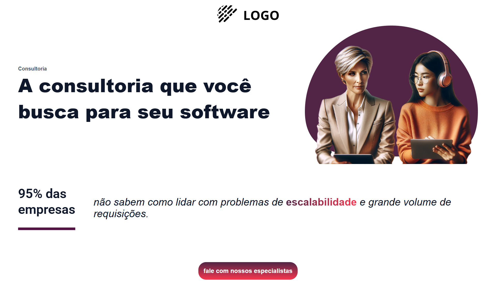

# Consultoria - Landing Page

Este é um projeto de **Landing Page** desenvolvido com **Angular**, com o objetivo de praticar e reforçar conhecimentos em desenvolvimento front-end. O foco principal foi criar uma interface moderna e responsiva para uma página de consultoria fictícia.

## 🚀 Tecnologias Utilizadas

- [Angular](https://angular.io/)
- HTML5
- SCSS/CSS3
- TypeScript

## 🎯 Objetivo

Este projeto foi desenvolvido **apenas para fins de estudo**. A ideia foi praticar a criação de componentes, organização de rotas e estruturação de um projeto Angular moderno.

## 📸 Preview

